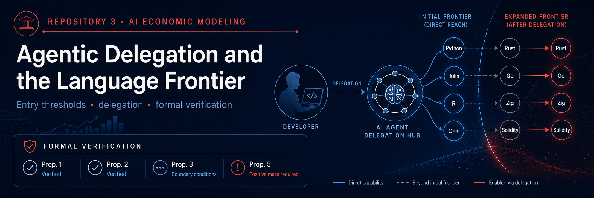

# Repository 3 — Quispe & Xu (2026)

<p align="center">
  
</p>

<p align="center">
  <strong>Agentic delegation · language frontier · activation band · formal verification</strong>
</p>

<p align="center">
  <a href="https://arxiv.org/abs/2605.25438">
    
  </a>
  <a href="presentation.pdf">
    
  </a>
  <a href="hand/prop-2-delegation-activation-band.pdf">
    
  </a>
  <a href="lean/README.md">
    
  </a>
  <a href="lean/FINAL_VALIDATION_REPORT.md">
    
  </a>
  <a href="prompts.md">
    
  </a>
</p>

**Citation:** Alexander Quispe and Kevin Xu (2026), *“Agentic Delegation and the Language Frontier of Software Developers: A Model and Evidence from Claude Code on GitHub.”*

This repository uses the substantially revised July 2026 arXiv v2 paper.

- arXiv: https://arxiv.org/abs/2605.25438

## 1. Economic question

The paper asks whether agentic AI only raises productivity within programming languages a developer already uses — the **intensive margin** — or also makes previously infeasible languages economical to enter — the **extensive margin**.

Its main object is the developer's **production frontier**: the set of programming languages in which the developer can profitably deliver work using any available production mode.

This is not necessarily the developer's unaided human-skill frontier. A developer may become able to produce in a language through delegation without personally acquiring full language-specific execution skill.

---

## 2. Developer and language environment

For developer $i$, language $k$, and month $t$:

- $\omega_{ik,t}$: opportunity value;
- $s_{ik,t} \in [0,1]$: language-specific execution skill;
- $a_i \geq 0$: general ability to specify, decompose, and verify tasks;
- $\bar{\mu}_{ik,t}$: posterior mean of the developer-language productivity match;
- $\pi_{ik,t} > 0$: belief precision, so the variance of the match is $1/\pi_{ik,t}$;
- $b_{ik,t}$: language activation or entry cost;
- $\gamma > 0$: CARA risk-aversion coefficient.

The developer chooses among the production modes available under technology generation $g$:

```math
V^g_{ik,t}
=
\max_{m \in M^g}
V^m_{ik,t}.
```

A language becomes active whenever the best available production mode generates nonnegative certainty-equivalent surplus:

```math
Z^g_{ik,t}
=
\mathbf{1}
\left\{
V^g_{ik,t} \geq 0
\right\}.
```

The total number of active languages is therefore

```math
N^g_{it}
=
\sum_k Z^g_{ik,t}.
```

---

## 3. Solo production

Suppressing $(i,k,t)$ subscripts, the certainty-equivalent surplus from solo production is

```math
V^S
=
\omega
+
s\bar{\mu}
-
\frac{\gamma s^2}{2\pi}
-
b.
```

The terms have the following interpretation:

- $\omega$: value of the current opportunity;
- $s\bar{\mu}$: expected language-specific human output;
- $\frac{\gamma s^2}{2\pi}$: risk penalty generated by uncertainty about the developer-language productivity match;
- $b$: fixed activation cost.

Solo production is feasible whenever

```math
V^S \geq 0.
```

Rearranging gives

```math
\omega
\geq
b
-
s\bar{\mu}
+
\frac{\gamma s^2}{2\pi}.
```

Define the **solo entry threshold**

```math
T^S
=
b
-
s\bar{\mu}
+
\frac{\gamma s^2}{2\pi}.
```

Therefore,

```math
\omega \geq T^S
```

is the condition for solo production to be feasible.

The threshold:

- rises with activation cost $b$;
- rises with risk aversion $\gamma$;
- falls as belief precision $\pi$ increases;
- falls with expected language-specific productivity $s\bar{\mu}$.

The total effect of execution skill $s$ can be ambiguous because greater skill raises expected output but also increases exposure to uncertain developer-language match quality.

---

## 4. Conversational AI

Conversational AI provides a productivity gain that scales with the developer's existing language-specific execution skill.

Its surplus is

```math
V^C
=
V^S
+
\lambda s
-
r_C,
```

where:

- $\lambda s$: productivity gain from conversational assistance;
- $r_C$: interaction cost of using conversational AI.

The conversational-AI threshold is

```math
T^C
=
T^S
-
(\lambda s-r_C).
```

Because the developer can choose either solo production or conversational assistance, the effective Generation-1 threshold is

```math
T^1
=
\min
\left\{
T^S,T^C
\right\}.
```

Equivalently,

```math
T^1
=
T^S
-
\max
\left\{
0,\lambda s-r_C
\right\}.
```

### Assumption 1 — Augmentation requires a foothold

For unfamiliar languages,

```math
\lambda s-r_C \leq 0.
```

For familiar languages with skill level $\bar{s}$,

```math
\lambda \bar{s}-r_C > 0.
```

Therefore, for an unfamiliar language,

```math
T^1=T^S.
```

Under this maintained assumption, conversational AI improves productivity in familiar languages but does not lower the entry threshold of unfamiliar languages.

This is a **modeling assumption**, not a universal theorem about conversational AI.

---

## 5. Agentic delegation

Agentic AI adds a new production mode in which the agent executes a share $\kappa \in (0,1]$ of the task.

Delegated surplus is

```math
V^D
=
\omega
+
(1-\kappa)s\bar{\mu}
+
\kappa a z(A)
-
\rho(a,s)
-
r_D
-
b
-
\frac{\gamma}{2}
\left[
\frac{(1-\kappa)^2s^2}{\pi}
+
\sigma_D^2(a,s,A)
\right].
```

The components are:

- $(1-\kappa)s\bar{\mu}$: human execution that remains after delegation;
- $\kappa a z(A)$: output produced through delegated execution;
- $a$: general developer ability;
- $z(A)$: execution competence of an agent with capability $A$;
- $\rho(a,s)$: specification and verification cost;
- $r_D$: compute and interaction cost of delegation;
- $\sigma_D^2(a,s,A)$: residual variance from agent execution errors.

Delegation also reduces exposure to uncertain human-language productivity because the developer personally executes only share $1-\kappa$.

Delegated production is feasible when

```math
V^D \geq 0.
```

Rearranging gives the delegated entry threshold:

```math
T^D
=
b
-
(1-\kappa)s\bar{\mu}
-
\kappa a z(A)
+
\rho(a,s)
+
r_D
+
\frac{\gamma}{2}
\left[
\frac{(1-\kappa)^2s^2}{\pi}
+
\sigma_D^2(a,s,A)
\right].
```

The effective Generation-2 threshold is

```math
T^2
=
\min
\left\{
T^1,T^D
\right\}.
```

Since the developer keeps access to all previous production modes, adding delegation cannot reduce the feasible production set.

---

## 6. Proposition 1 — Frontier expansion

Generation 1 provides the menu

```math
M^1
=
\{S,C\},
```

while Generation 2 adds delegation:

```math
M^2
=
\{S,C,D\}.
```

Therefore,

```math
M^1 \subset M^2.
```

This immediately implies

```math
V^2_{ik,t}
\geq
V^1_{ik,t}.
```

Hence,

```math
Z^2_{ik,t}
\geq
Z^1_{ik,t},
```

and therefore

```math
N^2_{it}
\geq
N^1_{it}
```

**path by path**.

The weak result follows simply from menu expansion: if delegation is unattractive, the developer can ignore it.

Language-count expansion is strict at date $t$ only if at least one language is infeasible under the Generation-1 menu but feasible under delegation:

```math
V^1_{ik,t}<0
\leq
V^D_{ik,t}.
```

Equivalently,

```math
T^D_{ik,t}
\leq
\omega_{ik,t}
<
T^1_{ik,t}.
```

---

## 7. Proposition 2 — Activation band

For an unfamiliar language, Assumption 1 implies

```math
T^1=T^S.
```

Define the **delegation advantage**

```math
B
=
T^S-T^D.
```

Substituting the two thresholds gives

```math
B
=
\kappa
\left[
az(A)-s\bar{\mu}
\right]
-
\rho(a,s)
-
r_D
+
\frac{\gamma}{2}
\left[
\frac{(2\kappa-\kappa^2)s^2}{\pi}
-
\sigma_D^2(a,s,A)
\right].
```

This expression contains three economic forces.

### 1. Expected execution substitution

```math
\kappa
\left[
az(A)-s\bar{\mu}
\right].
```

Delegation is more valuable when agent-assisted execution using general ability $a$ is more productive than the language-specific human execution it replaces.

### 2. Verification and compute costs

```math
-\rho(a,s)-r_D.
```

Delegation is less attractive when specification, verification, compute, or interaction costs are high.

### 3. Risk substitution

```math
\frac{\gamma}{2}
\left[
\frac{(2\kappa-\kappa^2)s^2}{\pi}
-
\sigma_D^2(a,s,A)
\right].
```

Delegation reduces exposure to uncertain human-language match quality but introduces residual agent-error risk.

If

```math
B>0,
```

then

```math
T^D<T^S=T^1.
```

The interval

```math
T^D
\leq
\omega
<
T^S
```

is the **activation band**.

Proposition 2 can therefore be written as

```math
Z^2-Z^1
=
\mathbf{1}
\left\{
T^D
\leq
\omega
<
T^S
\right\}.
```

The three regions are:

### Below the delegated threshold

```math
\omega<T^D.
```

The opportunity is infeasible both before and after agentic delegation.

### Inside the activation band

```math
T^D
\leq
\omega
<
T^S.
```

The opportunity was previously infeasible but becomes feasible through delegation.

### Above the solo threshold

```math
\omega\geq T^S.
```

The language was already feasible before agentic AI.

Therefore:

```text
              activation band
                     ↓
──────────────|================|──────────────>
             Tᴰ               Tˢ

 infeasible      activated         already feasible
 under both      by delegation     before delegation
```

A positive-width interval alone is not sufficient to guarantee actual activation. The opportunity distribution must also place positive probability mass inside

```math
[T^D,T^S).
```

---

## 8. Where I did not believe the LLM / referee checks

### A. Version verification

The initial prompt referenced:

> *“Coding Beyond Your Training: Claude Code and the Technological Frontier of Software Developers.”*

This was not a fabricated citation. It was the genuine arXiv v1 title.

The LLM correctly refused to invent bibliographic information, sample sizes, theoretical results, or numerical estimates without inspecting a source.

The July 2026 v2 paper changed several important elements:

- the title changed;
- Kevin Xu was added as a coauthor;
- the estimation sample changed from 5,838 to 5,346 developers;
- the theoretical mechanism changed substantially.

Version 1 emphasized Bayesian learning and switching barriers. Version 2 centers on delegated execution, entry thresholds, and the activation band.

---

### B. Does frontier expansion uniquely require an agent?

Not mathematically.

Suppose conversational AI generates positive net value even in an unfamiliar language:

```math
\lambda s-r_C>0.
```

Then

```math
T^C
=
T^S
-
(\lambda s-r_C)
<
T^S.
```

Conversational AI could therefore activate opportunities satisfying

```math
T^C
\leq
\omega
<
T^S.
```

Thus frontier expansion is not mathematically unique to agents.

The baseline paper rules out this possibility through Assumption 1:

```math
\lambda s-r_C\leq0
```

for unfamiliar languages.

The qualitative distinction between conversational and agentic AI therefore depends on how the two technologies are modeled:

- conversational assistance scales with existing language-specific skill;
- delegated execution can rely on general ability and agent competence.

---

### C. Does $T^D$ really not depend on language-specific skill?

Figure 1 describes the delegation threshold $T^D$ as not requiring language-specific skill.

Taken literally as mathematical independence from $s$, that statement would be too strong.

Equation (6) still contains $s$ through:

1. retained human execution;
2. verification cost $\rho(a,s)$;
3. remaining human-match risk;
4. residual delegated-error variance $\sigma_D^2(a,s,A)$.

The relevant distinction is therefore not

```math
T^D
\text{ is independent of }
s.
```

Rather, delegation does not require a positive language-specific skill **foothold** for its principal execution benefit:

```math
\kappa a z(A).
```

This delegated-output component can remain valuable even when $s$ is very low.

This is best interpreted as a compressed economic statement, not a mathematical error in the paper.

---

## 9. Empirical context

The empirical analysis uses a panel of:

- **5,346 developers**;
- **28 months**;
- approximately **57.2 million changed files**.

Claude Code adoption is dated using the first commit containing the machine-readable trailer:

```text
Co-Authored-By: Claude
```

The main event-time estimates at adoption are:

- active programming languages: **+2.528**;
- newly used programming languages: **+1.193**;
- Shannon language entropy: **+0.382**.

These outcomes correspond naturally to the theoretical mechanisms:

- active-language growth → expansion of the production set;
- newly used languages → empirical analogue of activation;
- higher entropy → diversification across languages.

The authors interpret the estimates as **event-time associations**, not definitive causal effects.

A central identification concern is endogenous adoption timing: developers may adopt Claude Code precisely when beginning new projects or entering unfamiliar languages.

---

## 10. Comparison with Aouad, Lykouris & Zhong

The two papers analyze different margins of AI adoption.

### Aouad, Lykouris & Zhong

AI acts as a substitutable productive input inside a task that is already feasible.

The main adjustment margin is human implementation effort:

```text
AI ↑ → human implementation effort ↓
```

### Quispe & Xu

Agentic AI adds a new delegated production mode.

The main adjustment margin is whether a language-task opportunity satisfies its participation or entry constraint:

```text
AI ↑ → feasible language set may expand
```

The modeling distinction is therefore:

- **Aouad et al.:** input substitution inside an already selected task;
- **Quispe–Xu:** delegation can relax a participation constraint and expand the feasible production set.

The mechanisms are complementary rather than contradictory.

Agentic AI may both reduce human execution effort within an activated task and enable entry into task-language opportunities that were previously infeasible.

---

## 11. Main takeaway

Agentic AI can change not only how productively a developer works inside an existing technological domain, but also which domains are economically feasible to enter.

The key mechanism is **delegated execution**.

Conversational AI is modeled as assistance whose value scales with existing language-specific skill. Agentic delegation instead allows part of execution to depend on general developer ability and agent competence:

```math
\kappa a z(A).
```

When delegation lowers the entry threshold sufficiently,

```math
T^D<T^S,
```

an activation band appears:

```math
T^D
\leq
\omega
<
T^S.
```

Languages inside this interval are outside the developer's pre-agent production frontier but become feasible after delegation.

---

## Repository contents

- `README.md` — model summary, propositions, and referee checks
- `prompts.md` — raw LLM prompts and responses
- `hand/` — handwritten derivations:
  - `prop-2-delegation-activation-band.pdf` — main derivation of the delegation threshold and activation band
  - `cara-normal-certainty-equivalent.pdf` — supplementary CARA–Normal expected-utility and certainty-equivalent derivation
- `presentation.tex` — twenty-minute Beamer presentation source
- `presentation.pdf` — compiled presentation
- `lean/` — EconCSLib formalization, proofs, audits, and validation report
- `lean-check.txt` — recorded EconCSLib fast-check result
- `paper/` — paper reference and local study material

## Formal verification with EconCSLib

The model was also formalized using the EconCSLib paper-formalization workflow. The complete generated contribution is preserved in [`lean/`](lean/), and the final status is **partially formalized**.

Main verification results:

- **Proposition 1:** the weak frontier-expansion result is proved path by path from menu inclusion.
- **Proposition 2:** the activation-band identity is formally verified once the delegated threshold is strictly below the solo threshold.
- **Proposition 3:** the printed strict dynamic claim requires additional boundary conditions. Strict growth and strict concavity require a nonempty unfamiliar-language frontier and relevant hazards satisfying \(0 < p^2_{ik} < 1\). In particular, the allowed endpoint \(p^2_{ik}=1\) provides a counterexample to strict growth.
- **Proposition 5:** weak repository expansion is valid, but strict expansion additionally requires positive opportunity mass in at least one interval where delegation lowers the entry threshold.

The final EconCSLib fast check completed successfully with exit code `0`, and the generated Lean files contain no `sorry` or `admit`. This verifies the encoded formal statements, but does not by itself establish semantic equivalence between every Lean declaration and every claim in the paper. Human semantic review remains **0/9**.

See [`lean/FINAL_VALIDATION_REPORT.md`](lean/FINAL_VALIDATION_REPORT.md) for the formalization audit and [`lean-check.txt`](lean-check.txt) for the recorded validation check.

